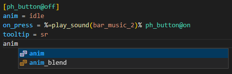

# 0.6.2

* Система диагностики кода и решения ошибок были перенесенны на классы, чтобы упростить работу
* Добавлены решение ошибок:
    * Удаление строки
* Исправлено сворачивание секций
* Исправлена проверка функций для условий и действий в Condlist-е
* Исправлено автодополнение ключевых слов

# 0.6.1

* Исправлена ошибка с недостающими параметрами в некоторых секциях

# 0.6

* Добавлена диагностика кода на ошибки:
    * Объявление нескольких секций в одной строке
    * Дублирование секций с одинаковым названием
    * Ссылка на несуществующую секцию
    * Неверный тип секции
    * Неиспользуемая секция
    * Пустая секция
    * Ссылка на самого себя
    * Ссылка на несколько секций в одном Condlist-е
    * Проверка условия с инфопоршнями
    * Проверка условия с функциями
    * Вызов несуществующей функции
    * Некорректная запись параметра
    * Неизвестный параметр
* Добавлены решение ошибок:
    * Удаление секции
    * Замена ссылки на nil
    * Удаление секции и замена ссылок на nil
    * Рекомендации по замене типа секции, если оно неверно
    * Рекомендации по замене функции, если она неверна
    * Рекомендации по замене параметра, если он неверный
    * Добавление объявления секции
* Исправлена ошибка при запуске программы через команду
* Добавлены и исправлены настройки диагностики
* Небольшие исправления и чистка кода 

# 0.5.4

* Поддержка документации для секций
* Исправлена критическая ошибка с зависимостями

# 0.5.3

* Hover Provider для локализации
* Предпросмотр секций при автодополнении `Task` или `Squad` переменных
* Исправлена ошибка, которая происходила при наличии одинаковых названий функций в `xr_effects.script` и `xr_conditions.script`
* Исправление Highligthing-а
* Некоторое количество мелких исправлений

# 0.5.2

* Добавлена документация для некоторых параметров 
* Добавлена возможность в обновить документацию расширения при помощи команды. Так же, по умолчанию, при запуске расширения идет автоматическое обновление файлов, которое можно отключить в настройках. Данная функция требует подключение к интернету.
* Модуль, отвечающий за автодополнение, объеденён в один общий
* Исправлена ошибка, при которой не отображались параметры
* Некоторое количество мелких исправлений

# 0.5.1

* Исправление критической ошибки при работе с локализацией

# 0.5

* Добавлена возможность запуска игры или другого приложения из редактора. Подробнее на [Wiki](https://github.com/AziatkaVictor/ltx-support/wiki/Start-Game-from-VSCode)
* Добавлена возможность обновить информацию о скриптах с помощью команды `Update Scripts`
* Добавлена документация для параметров *(написание в процессе)* и команда, для её написания
* Добавлено автодополение сигналов
* Добавлена поддержка файлов: 
    * Заданий
    * Сквадов
    * Регистрации звуков
    * Торговли
* Добавлена подержка секций: 
    * Anomal_zone
    * Smart_control
    * Smart_terrian
* Добавлена подержка параметров, свойственых логике НПС
* Добавлено автодополнение части параметра, на основе его типа
* Подсветка на основе синтакиса для сигналов
* Добавлены иконки файлов для расширения `*.ltx`
* Исправлен алгоритм получения локализации, при котором он ломался, если получал пустую таблицу
* Чистка кода
* Исправление мелких ошибок

# 0.4

* Добавлено автодополнение ключевых слов, таких как `true`, `false` или `nil`
* Добавлена поддержка документации. Теперь есть возможность удобно, внутри расширения, наприметь документацию к функциям, через комманду `Add Documentation`. Подробнее процесс описан на [Wiki](https://github.com/AziatkaVictor/ltx-support/wiki/Documentation-Guide) 

* Добавлен Hover Provider, который позволил реализовать отображение документации функции при наведении на неё: 

* Перенос части подсветки синтаксиса на готовое решение языкового расширения VSCode. Это ускорило работу расширения.
* Добавленно автодополнение переменных из файлов локализации.
* Добавлен Symbols Provider, который теперь отображает структуру файла и даёт возможность нафигации по файлу: 
 

* Добавлен Folding Provider, который дал возможность сворачивать секции: 

* Написана некоторая часть документации для функций логики, ~20-30 функций.

# 0.3

* Добавлено автодополнение параметров секций, которые свойственны всем типам: 

* Добавлено автодополнение параметров секций на основе их типа: 

* Добавлено автодополнение инфопоршнаями из текущего файла: 

* Убрано из автодополения ссылками на секции название текущой секции
* Путь к скриптам теперь береться относительно рабочой папки
* Добавлены некоторые Snippet-ы, которые должны ускорить работу с секциями: _(WIP)_ 

* Проверки положения курсора перенесены в класс документа
* Добавлен тип документа, который позволит разделить алгоритм на работу с разными типами _(файлы логики, конфиги, секции предметов, сквадов, квестов)_
* Добавлена автодополнение типов секций для объявления внутри `[]`: 

* Перерарботка структуры кода расширения, распределив функционал на Provider-ы, чтобы работать было было комфортнее
* Добавлено условия для работы автодополения ссылки на секцию 
* Корректировка подсветки текста для путей к файлам
* Исправление мелких ошибок

# 0.2.2

* Добавлено автодополение секциями из текущего файла: 
 
* У сквадов и квестов теперь новые иконки: 
 
* Исправлена ошибка с автодополением функций и проверок для логики
* Исправлена ошибка при проверке расположения курсора внутри скобок `%%` и `{}`
* Небольшие исправления кода, связанные с асинхронными алгоритмами
* Исправлена проблема, которая могла появиться при открытии файла
* Теперь в памяти может храниться несколько документов
* Исправлена ошибка, когда не обновлялась подсветка синтаксиса при открытии файла
* Теперь сквады и квесты предлагаются только внутри скобок `%%` и `{}`

# 0.2.1

* Исправлена ошибка с поиском файлом для сквадов и квестов
* Добавлена возможность указать путь к папке `misc`
* Переделаны настройки расширения, в соответствии со стандартами
* Изменена структура исходного кода расширения
* В процессе добавление документации в коде для тех, кто хочет помочь в разработке расширения
* Добавлены асинхронные алгоритмы, для ускорения работы расширения.  До:  
 
После (обычно это быстрее в 10-25 раз): 

* Сделаны небольшие исправление ошибок и оптимизация кода

# 0.2

* Добавлена поддержка подсказок со сквадами и заданиями (Работает только при условии, что файлы находятся в нужных папках и имеют стандартный паттерн у названия файла). 

* Поддержка упрощенного алгоритма парсинга файла для оптимизации
* Оптимизация работы расширения
* Информация об подсветке синтаксиса теперь храниться внутри файла
* Небольшие исправления

# 0.1.4

* Добавлены необходимы библиотеки в пакет установки, теперь расширение должно работать
* Изменение названия параметров
* Небольшие изменения

# 0.1.3

* Исправлен алгоритм поиска `condlist-ов`
* Исправлена проверка нахождения курсора в скобках
* Добавлена поддержка подсветки синтаксиса в `fsgame.ltx`
* Исправлен алгоритм поиска ссылок на секции
* Подсветка булевых значение `true\false` в сигналах
* Поддержка работы алгоритма в тексте без секций (необходимо для случаев, подобных `fsgame.ltx`)

# 0.1.2

* Исправление алгоритма поиска параметра
* Добавление проверки на число в значении сигнала
* Небольшие исправления

# 0.1.1

* Исправление алгоритма поиска объявления секции
* Исправление проверки нахождения курсора внутри специальных `"скобок"`
* Исправление алгоритма поиска `condlist-ов`
* Добавление несколько `try-catch` конструкций

# 0.1

* Предложение функций и предусловий для логики
* Поддержка кастомных файлов со скриптами
* Подсветка ключевых слов
* Подсветка условий
* Подсветка функций
* Подсветка чисел
* Подсветка ссылок на секции
* Создана структура файла, для более удобной работы с данными