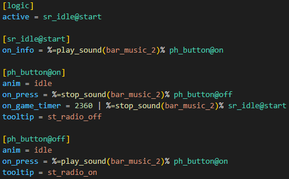
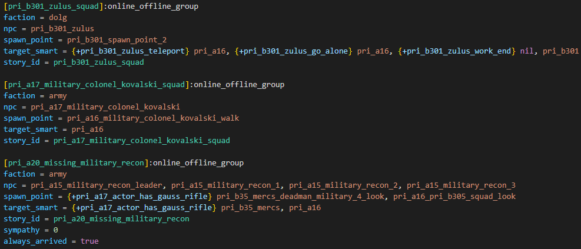
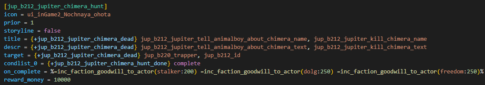
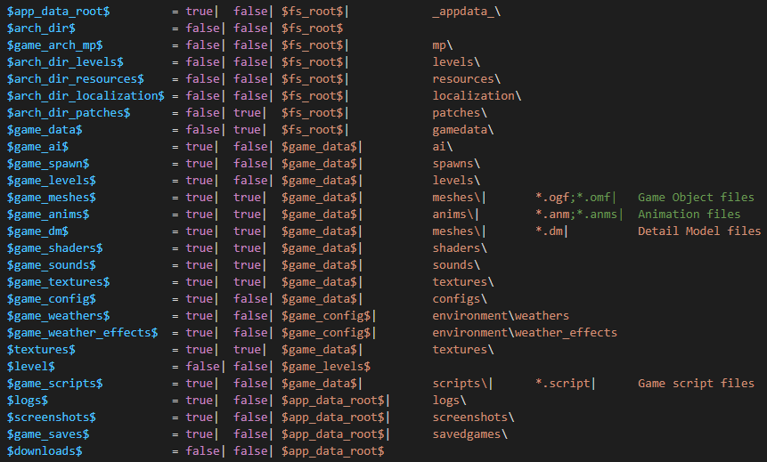
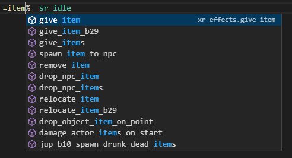
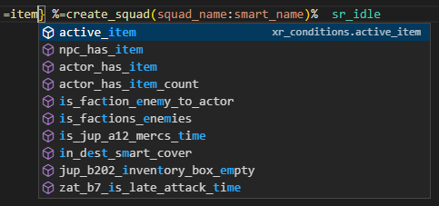

# ltx-support

Расширение для Visual Studio Code, которое добавляет поддержку синтаксиса логики из S.T.A.L.K.E.R. Call of Pripyat.

## Настройки

Чтобы зайти в настройки расширения необходимо:

* Нажать `Ctrl+Shift+P => Open Settings (UI)`.
* Открыть `Extensions => LTX` или просто написать в поиске `ltx`.

## Подсветка синтаксиса

Расширение анализирует документ, сохраняя структуру в памяти. Благодаря этому можно более точно подсвечивать синтаксис, без усложнения регулярных выражений. 

### Подсветка обычного файла логики 

### Подсветка squad-ов

### Подсветка квестов

### Подсветка fsgame.ltx

### Как это работает? 

Первым делом оно ищет объявление секции, после каждая строка, которая не объявляет секцию будет считаться за строку с параметром. Рассмотрим алгоритм на такой строке:

`on_game_timer = 2500 | {=precondition() -info1} %=action() +info2% section@link`

Текст делиться на 3 части:

* Имя параметра `on_game_timer`
* Сигнал `2500`
* Condlist `{=precondition() -info1} %=action() +info2% section@link`

## Работа с документацией

Расширение позволяет писать собственную документацию. На данный момент функционал готов не полностью, поэтому рекомендую особо не ковырять расширение. Как только будет решено, каким образом это должно работать, здесь появиться информация об этом.

## Функции

Есть возможность указать собственные файлы со скриптами, для этого нужно в настройках указать путь к папке. Расширение само обновиться и будет предлагать вам функции. 

### Автозаполнение функций

### Автозаполнение проверок

Так же хочу предупредить, что программа сама определяет расположение скобок `%%` и `{}`, поэтому подсказки функций будут появляться только внутри них.

## Roadmap

* Предложение переменных локализации
* Поддержка файлов с секциями квестов, сквадов, смартов, предметов, персонажей
* Оптимизация алгоритма анализа функций логики
* Кастомизация документации
* Заготовки с кусочками кода
* Анализ документа на ошибки
* Полноценная документация для функций логики
* Помощь с переменными у функций
* Подсветка особых типов данных (переменные, аргументы)

## Сборка расширения

Чтобы собрать расширение самому, необходимо:

1. Скачать исходники с помощью `git clone`, потому что я не рекомендую вам компилировать на файлах, которые лежат в папке со скаченным расширением. Лучше лишний раз перестраховаться.
2. Открыть проект, запустить в консоли `npm install` или нажать ПКМ на `package.json` в спойлере `NPM Scripts` и нажать на пункт `Run install`.
3. После установки всех необходимых библиотек, необходимо нажать `Launch` во вкладке `Run and Debug` или на горячую клавишу `F5`.
4. Готово. Должно открыться новое окно VS Code, в котором будет 2 тестовых файла.

## Ссылки

* [Профиль на AP-PRO.RU](https://ap-pro.ru/profile/6-aziatkavictor/)
* [Тема на форуме](https://ap-pro.ru/forums/topic/3561-vscode-podderzhka-sintaksisa-cop/)